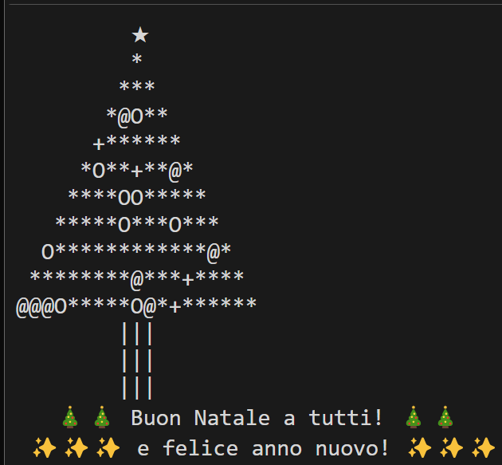

# 🎄 Generatore di Albero di Natale in Python 🎄

Questo script Python genera un albero di Natale testuale con decorazioni casuali, un tronco ben definito e messaggi di auguri personalizzati. È ideale per creare un effetto festivo nel terminale o come output integrato in altri contesti!

## 🛠️ Caratteristiche

- **Albero personalizzabile**: Specifica l'altezza, il numero di livelli del tronco e la larghezza del tronco.
- **Decorazioni casuali**: Puoi scegliere tra decorazioni predefinite come `O`, `*`, `@`, `+`, oppure aggiungere le tue.
- **Messaggi festivi**: Lo script aggiunge automaticamente messaggi di auguri alla base dell'albero.
- **Compatibilità con Excel**: L'output è formattato per l'utilizzo in Excel, con righe separate da `CHAR(10)`.

## 💻 Script Python

Ecco lo script Python utilizzato per generare l'albero di Natale:

```python
import random

# Parametri dell'albero
altezza = 10  # Altezza dell'albero
tronco_altezza = 3  # Altezza del tronco
tronco_larghezza = 3  # Larghezza del tronco
decorazioni = ["O", "*", "@", "+"]  # Decorazioni casuali

# Funzione per aggiungere decorazioni casuali
def decora(riga):
    return "".join(
        random.choice(decorazioni) if char == "*" and random.random() > 0.7 else char
        for char in riga
    )

# Costruzione dell'albero con una stella sulla cima
albero = []
albero.append(" " * (altezza - 1) + "★")  # Aggiungi una stella sulla cima
for i in range(altezza):
    spazi = " " * (altezza - i - 1)
    stelle = "*" * (2 * i + 1)
    riga_decorata = decora(spazi + stelle)
    albero.append(riga_decorata)

# Costruzione del tronco
tronco_spazi = " " * (altezza - tronco_larghezza // 2 - 1)
for _ in range(tronco_altezza):
    albero.append(tronco_spazi + "|" * tronco_larghezza)

# Aggiungi un messaggio di auguri alla base
auguri = [
    " " * (altezza - 7) + "🎄🎄 Buon Natale a tutti! 🎄🎄",
    " " * (altezza - 9) + "✨✨✨ e felice anno nuovo! ✨✨✨"
]
albero.extend(auguri)

# Unisci tutte le righe in una stringa separata da CHAR(10) per Excel
output = "\n".join(albero)

# Restituisci il risultato come stringa con CHAR(10) per Excel
print(output)
```

Ecco un esempio dell'output generato:



## 📋 Parametri principali

- `altezza`: l'altezza dell'albero (default: `10`).
- `tronco_altezza`: il numero di righe del tronco (default: `3`).
- `tronco_larghezza`: la larghezza del tronco (default: `3`).
- `decorazioni`: un elenco di simboli utilizzati per decorare l'albero (default: `["O", "*", "@", "+"]`).

## 🔧 Personalizzazione

Puoi modificare i seguenti parametri per adattare l'output:
- Cambia `altezza`, `tronco_altezza` o `tronco_larghezza` per modificare la struttura dell'albero.
- Aggiungi nuovi simboli all'elenco `decorazioni` per rendere l'albero unico.
- Personalizza i messaggi festivi nella sezione `auguri` per includere saluti personali.

## 🧪 Requisiti

- Python 3.x
- Nessuna dipendenza esterna

## 📜 Licenza

Questo progetto è distribuito sotto la licenza MIT. Sentiti libero di usarlo e modificarlo per scopi personali o professionali.

---

Buon divertimento con il tuo albero di Natale virtuale! 🎅🎁
